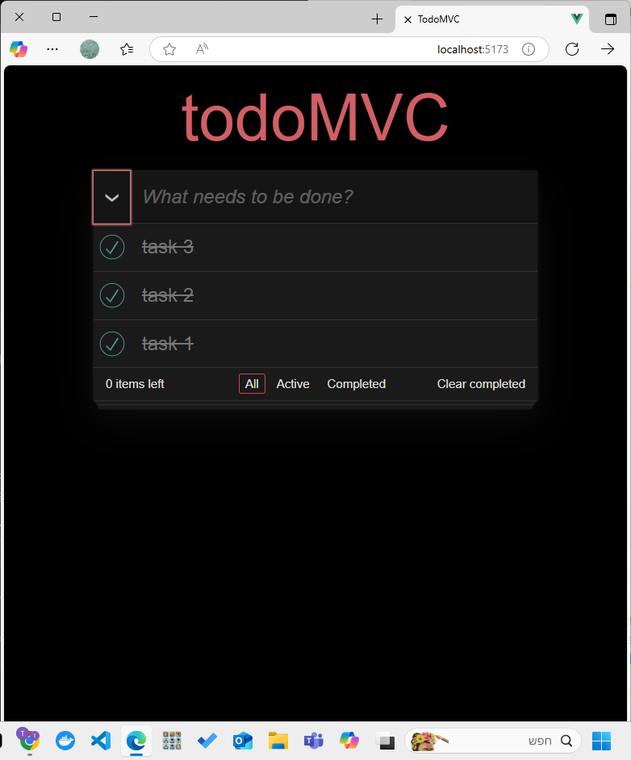

# Mini JavaScript Framework - TodoMVC App

A lightweight JavaScript framework with a fully functional TodoMVC application built from scratch. This project demonstrates modern web development concepts including DOM manipulation, state management, routing, and event handling.

## 📸 Screenshots


*Main view of the TodoMVC application*


*Todo app with multiple items and filtering*


*Completed todos view with clear completed functionality*

## 🚀 Quick Start

### Prerequisites

- Node.js (version 14 or higher)
- npm or yarn

### Local Development

1. **Clone the repository**

   ```bash
   git clone https://github.com/talaamm/mini-js-framework
   cd mini-js-framework
   ```

2. **Install dependencies**

   ```bash
   npm install
   ```

3. **Start development server**

   ```bash
   npm run dev
   ```

4. **Open your browser**
   Navigate to [http://localhost:5173](http://localhost:5173)

### Production Build

```bash
npm run build
npm run preview
```

## 🌐 Deployment

### GitHub Pages Deployment (Fixed)

### Live Demo

- **GitHub Pages**: [Your GitHub Pages URL]

## 📁 Project Structure

```
mini-js-framework/
├── assets/                 # Screenshots and images
├── dist/                   # Production build output
├── src/
│   ├── components/         # React-like components
│   │   ├── TodoApp.js      # Main application component
│   │   ├── TodoList.js     # Todo list container
│   │   └── TodoItem.js     # Individual todo item
│   ├── framework/          # Core framework modules
│   │   ├── dom.js          # DOM manipulation utilities
│   │   ├── events.js       # Event handling system
│   │   ├── router.js       # Client-side routing
│   │   └── state.js        # State management
│   ├── helper.js           # Utility functions
│   └── index.js            # Application entry point
├── index.html              # Main HTML file
├── styles.css              # Application styles
├── package.json            # Dependencies and scripts
└── vite.config.js          # Vite configuration
```

## 🎯 TodoMVC Features

### Core Functionality

- ✅ **Add todos** - Type and press Enter to add new todos
- ✅ **Toggle todos** - Click checkbox to mark as complete/incomplete
- ✅ **Delete todos** - Click the X button to remove todos
- ✅ **Edit todos** - Double-click to edit todo text
- ✅ **Toggle all** - Mark all todos as complete/incomplete
- ✅ **Clear completed** - Remove all completed todos

### Filtering & Navigation

- 🔍 **All** - Show all todos (default view)
- 🔍 **Active** - Show only incomplete todos
- 🔍 **Completed** - Show only completed todos
- 🔍 **URL routing** - Direct links to filtered views

### State Persistence

- 💾 **Local state management** - Todos persist during session
- 💾 **Real-time updates** - UI updates immediately on state changes
- 💾 **Filter state** - Current filter is maintained in URL

## 🛠 Framework Architecture

### Core Modules

#### 1. DOM Module (`src/framework/dom.js`)

Provides virtual DOM-like functionality:

- `createElement()` - Create DOM elements from virtual nodes
- `render()` - Render elements to the DOM
- `findDOMNode()` - Find DOM elements by selector
- `updateDOMNode()` - Update element content
- `emptyElement()` - Clear element contents

#### 2. State Module (`src/framework/state.js`)

Centralized state management:

- `getState()` - Get current application state
- `setState()` - Update application state
- `filterTodos()` - Filter todos based on current filter

#### 3. Events Module (`src/framework/events.js`)

Event handling system:

- `addEvent()` - Add event listeners to elements
- Event delegation and management

#### 4. Router Module (`src/framework/router.js`)

Client-side routing:

- `init()` - Initialize routes
- `navigate()` - Navigate to different routes
- Hash-based routing for SPA functionality

### Component Architecture

#### TodoApp Component

- Main application container
- Header with input field
- Main section with todo list
- Footer with filters and actions

#### TodoList Component

- Renders list of todo items
- Handles filtering logic
- Updates UI based on state changes

#### TodoItem Component

- Individual todo item
- Toggle, edit, and delete functionality
- Inline editing with keyboard shortcuts

## 💡 Usage Examples

### Creating a Todo

```javascript
const addTodo = (text) => {
    const newTodo = {
        id: crypto.randomUUID(),
        text: text,
        isCompleted: false,
    }
    const updatedTodos = [newTodo, ...State.getState().todos];
    State.setState({ todos: updatedTodos });
}
```

### Toggling a Todo

```javascript
const toggleTodo = (todoId) => {
    const newTodos = State.getState().todos.map(todo => 
        todo.id === todoId 
            ? { ...todo, isCompleted: !todo.isCompleted }
            : todo
    );
    State.setState({ todos: newTodos });
}
```

### Filtering Todos

```javascript
const filterTodos = () => {
    const { todos, filter } = State.getState();
    switch (filter) {
        case 'active':
            return todos.filter(todo => !todo.isCompleted);
        case 'completed':
            return todos.filter(todo => todo.isCompleted);
        default:
            return todos;
    }
}
```

## 🎨 Styling

The application uses a clean, modern design inspired by TodoMVC:

- Responsive layout
- Smooth animations
- Keyboard accessibility
- Focus management
- Mobile-friendly interface

## 🔧 Development

### Available Scripts

- `npm run dev` - Start development server
- `npm run build` - Build for production
- `npm run preview` - Preview production build

### Key Technologies

- **Vanilla JavaScript** - No frameworks, pure JS
- **Vite** - Fast build tool and dev server
- **CSS3** - Modern styling with flexbox and grid
- **ES6 Modules** - Modern JavaScript module system

## 🐛 Troubleshooting

### Common Issues

1. **Black screen on GitHub Pages**
   - Ensure `vite.config.js` has correct `base` path
   - Check that assets are being served correctly
   - Verify build output in `dist/` folder

2. **Todos not persisting**
   - This is expected behavior (no localStorage implementation)
   - Todos are stored in memory only

3. **Routing not working**
   - Ensure you're using a web server (not file:// protocol)
   - Check browser console for errors

## 🤝 Contributing

1. Fork the repository
2. Create a feature branch
3. Make your changes
4. Test thoroughly
5. Submit a pull request

## 📄 License

This project is open source and available under the [ISC License](LICENSE).

## 🙏 Acknowledgments

- Inspired by [TodoMVC](http://todomvc.com/)
- Built with modern web standards
- Designed for learning and demonstration purposes

---

**Happy coding! 🚀**
